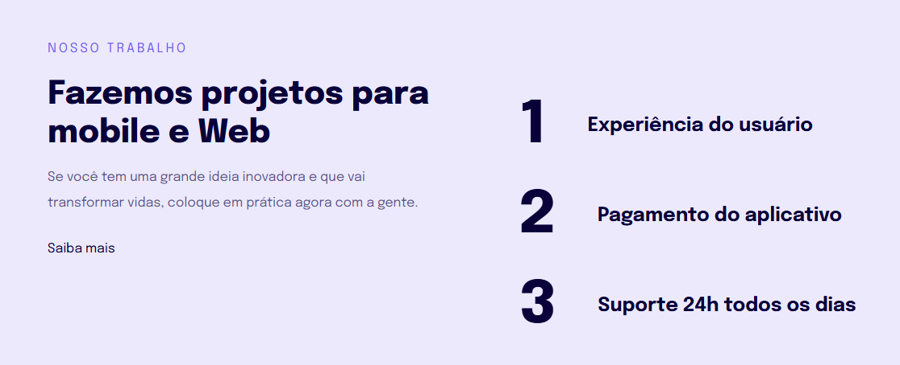
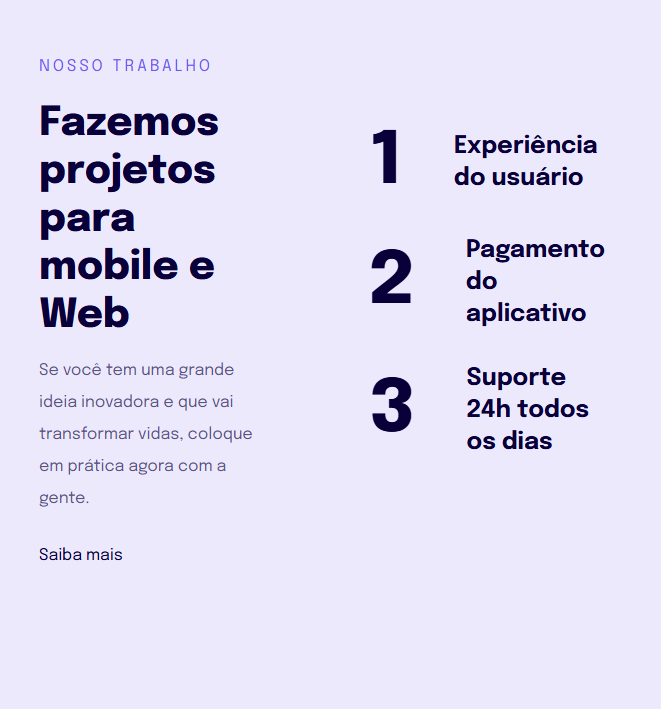

<h1 align="center"> Site seu destino </h1>

Este projeto foi feito seguindo aulas rocketseat  
<a href="https://lp.rocketseat.com.br">Link da rocket.</a>

  <a href="#-tecnologias">Tecnologias</a>
  <a href="#-projeto">Projeto</a>&nbsp;&nbsp;&nbsp;|&nbsp;&nbsp;&nbsp;
  <a href="#-layout">Layout</a>;
 

 

  *Desktop 💻
  

  
  

  *Celular 📱
  

  
  

## 🚀 Tecnologias

Esse projeto foi desenvolvido com as seguintes tecnologias:

- HTML e CSS
- Git e Github
- Figma

## 💻 Projeto

Este é apenas um projeto demonstração de uso de html e css para páginas, feito para desktop e celulares!

## 🔖 Layout

Layou feito com html e css.
